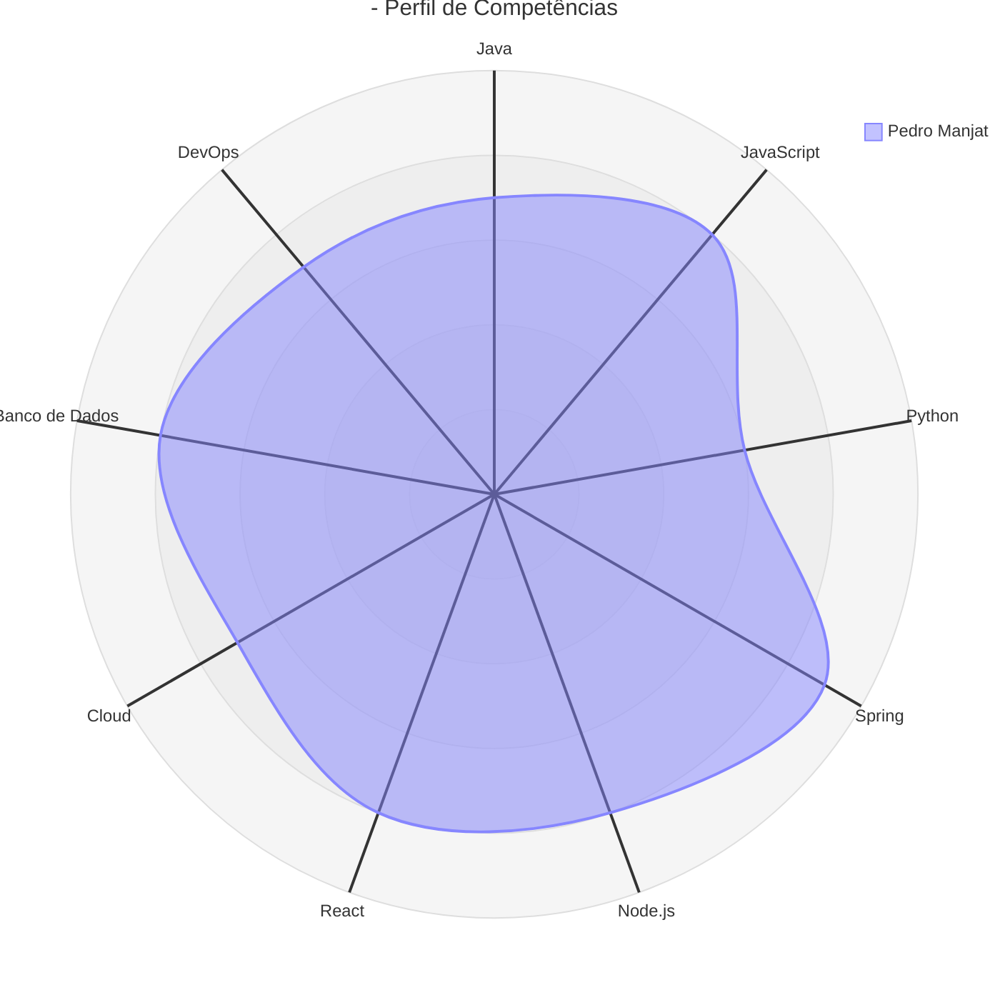

# Pedro Manjate Júnior - Desenvolvedor Full Stack

## 👋 Sobre Mim

Estudante finalista da Licenciatura em Informática pela UEM, com experiência prática em programação desktop e mobile. Possuo competências sólidas em gestão e manutenção de redes, administração de servidores Windows, eletrónica e configuração de equipamentos Cisco. Atuo também na criação de conteúdos para internet, unindo conhecimentos de desenvolvimento de software e infraestrutura para propor soluções tecnológicas completas e integradas.

## 📊 Estatísticas do GitHub

  

## 🛠️ Habilidades Técnicas

### Linguagens de Programação

### Frameworks e Bibliotecas

### Banco de Dados

### Cloud & DevOps

### Redes e Infraestrutura

## 📈 Gráfico de Competências

## 🎓 Formação

- **Licenciatura em Informática** - Universidade Eduardo Mondlane (UEM) - 2022–2025 (Em Andamento)
- **Services, Microservices & DevOps** - ICT4DEV - Agosto de 2024 (Concluído)
- **Certificação Alibaba Cloud** - Alibaba Cloud Academy (Concluído)

## 💼 Experiência Profissional

### 👨‍🏫 Assistente de Docência – Disciplina de Informática
**Universidade Eduardo Mondlane (UEM)**
- Prestação de apoio ao docente responsável na preparação e condução das aulas
- Suporte técnico e pedagógico aos estudantes durante sessões práticas
- Colaboração na organização e estruturação do conteúdo programático

### 💻 Desenvolvedor de Sistemas de Gestão de Stock para Microempresas
- Criação e implementação de sistemas simples de gestão de stock
- Organização de inventário, controle de entradas e saídas
- Melhoria dos processos operacionais para microempresas com recursos limitados

## 🌐 Idiomas

- **Português** - Nativo
- **Inglês** - Avançado

## 📫 Contato

📍 **Localização**: Maputo - Matola, Moçambique

---

⭐️ *Do [pedromanjate](https://github.com/pedromanjate)*
